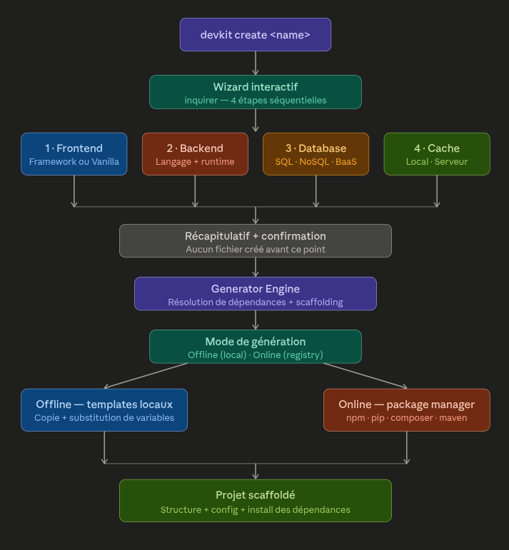

# 🎨 Bootstrap Integration Project

This project is a **frontend integration** built entirely with **Bootstrap 5**.  
It demonstrates a clean, responsive layout and modern design principles, suitable for websites, landing pages, or portfolios.

---

## 🧩 Features

- Fully responsive design  
- Built with **Bootstrap 5**  
- Smooth navigation and clean UI  
- Compatible with all modern browsers  
- Easy to customize and extend  

---

## 🖼️ Project Preview

Here’s a preview of the integrated project 👇  

---

## ⚙️ Installation & Setup

Clone this repository:

git clone https://github.com/MikaElliot/bankist-integration

## 🧠 Technologies Used
HTML5
CSS3
Bootstrap 5

## 🧑‍💻 Author

Developed by Mika Elliot — Frontend Developer & UI Designer
If you like this project, ⭐ it on GitHub and feel free to fork or reuse for learning purposes.

## ⚖️ License

This project is intended for educational purposes only.
Any commercial use, resale, or redistribution is strictly prohibited.
Violations may result in legal responsibility under intellectual property laws.

## 💡 Tip
To modify styles or layouts:
Edit the index.html and style.css files.

You can easily replace Bootstrap’s default theme with a custom one using variables or SCSS.
